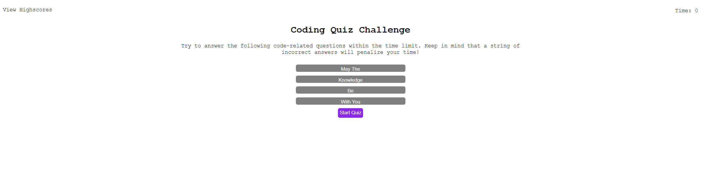

# Code_Quiz
# Description
Here is a quiz that features JavaScript functions, as well as, page layout and styling utulizing HTML and CSS. This quiz also features saved high-scores that can be found in local storage. Have fun!

## Table of Contents

* [License](#license)
* [Contributing](#contributing)
* [Screenshot](#screenshot)
* [Link](#link)
* [Questions](#questions)

## License

MIT

## Contributing

Ianaac27

# Screenshot
Here is a mock of the Coding Quiz.

# Link
Take a look at the live version [here.](https://ianaac27.github.io/Code_Quiz/)

## Questions

If you have any questions, please refer to my contact information below.

[GitHub: Ianaac27](https://www.github.com/Ianaac27)

Email: ian.fleshmancooper@gmail.com
